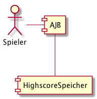
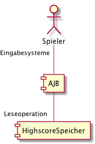

Kontextabgrenzung
=================

Mithilfe der Kontextabgrenzung soll aufgezeigt werden wo die Systemgrenzen liegen und welche Schnittstellen zur
Verfügung stehen.

Fachlicher Kontext
##################

Technischer Kontext
###################

