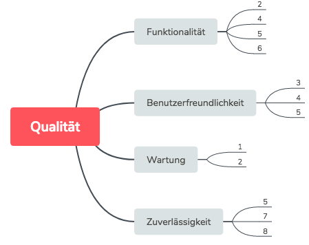

Qualitätsszenarien
==================

Um sicherstellen zu können ob die Software ein bestimmtes Qualitätsniveau erfüllt, muss die Anwendung folgende
Qualitätsszenarien erfüllen.

+-------+--------------------------------------------------------------------------------------------------------------+
|Nummer |Szenarien                                                                                                     |
+=======+==============================================================================================================+
|1      |Die Anwendung muss leicht zu Erweitern sein. Zum Beispiel müssen neue Behälter oder einen neuen Algorithmus   |
|       |zur Berechnung des Highscores hinzugefügt werden können, ohne bestehenden Quellcode ändern zu müssen.         |
+-------+--------------------------------------------------------------------------------------------------------------+
|2      |Es muss die Möglichkeit geben die Elemente zu konfigurieren ohne Quellcode ändern zu müssen. Das heißt, dass  |
|       |beispielsweise das Elementsymbol oder der Name geändert werden kann, ohne Änderungen am Quellcode vornehmen zu|
|       |müssen.                                                                                                       |
+-------+--------------------------------------------------------------------------------------------------------------+
|3      |Dem Anwender muss sich die grobe Funktion der Oberfläche ohne Hilfefunktion erschließen.                      |
+-------+--------------------------------------------------------------------------------------------------------------+
|4      |Es muss dem Anwender die Möglichkeit gegeben werden mittels einer Hilfefunktion die Oberfläche genauer zu     |
|       |erklären.                                                                                                     |
+-------+--------------------------------------------------------------------------------------------------------------+
|5      |Die Oberfläche soll bei längeren Berechnungsoperationen, dem Nutzer ein Feedback geben. Dies soll dem Nutzer  |
|       |helfen zu erkennen geben, dass die Anwendung etwas berechnet.                                                 |
+-------+--------------------------------------------------------------------------------------------------------------+
|6      |Die Anwendung soll auf verschiedenen Betriebssystemen lauffähig sein. Dies soll dem Anwender die Möglichkeit  |
|       |geben, mehrere Betriebsysteme zu nutzen und sich nicht festlegen zu müssen.                                   |
+-------+--------------------------------------------------------------------------------------------------------------+
|7      |Es muss sichergestellt werden, das nur zulässige Aktionen auf Substanzen ausgeführt werden.                   |
+-------+--------------------------------------------------------------------------------------------------------------+
|8      |Die HighScores sollen noch verfügbar sein, auch wenn die Anwendung geschlossen und neugestartet wird.         |
+-------+--------------------------------------------------------------------------------------------------------------+

Qualitätsbaum
=============

